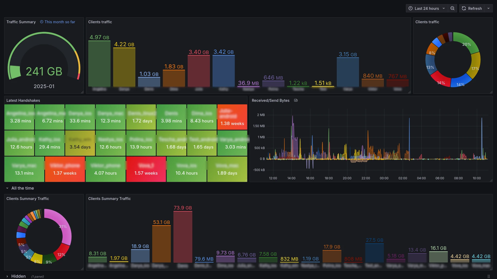

# AmneziaWG exporter

amneziawg-exporter is a Prometheus exporter for gathering AmneziaWG client connection metrics.

## Features and limitations

### Client identification

amneziawg-exporter can optionally identify WireGuard clients using a client table. If this feature is enabled, clients are identified by their names; otherwise, they are marked as "unidentified."

### Operating modes

amneziawg-exporter has three operating modes (`AWG_EXPORTER_OPS_MODE` environment variable):

- `http` - run an HTTP server on `AWG_EXPORTER_HTTP_PORT` to make metrics accessible, like most exporters. *Default*
- `metricsfile` - write metrics to `AWG_EXPORTER_METRICS_FILE` instead of serving them on http port.
- `oneshot` - same as in `metricsfile`mode but the service creates a metrics file and then shuts down.
  In Docker, you can use a volume to save the file on disk. It can then be taken by [node-exporter](https://github.com/prometheus/node_exporter) to serve your exporter metrics.

> [!TIP]
> Open [this link](https://github.com/prometheus/node_exporter#textfile-collector) to read more about the textfile collector.

## Configuration

The following environment variables can be used to configure amneziawg-exporter.

| Variable Name                        | Default Value               | Description                                                             |
|--------------------------------------|-----------------------------|-------------------------------------------------------------------------|
| AWG_EXPORTER_SCRAPE_INTERVAL         | 60                          | Interval for scraping WireGuard metrics (for the `http` mode).          |
| AWG_EXPORTER_HTTP_PORT               | 9351                        | Port for HTTP service.                                                  |
| AWG_EXPORTER_METRICS_FILE            | /tmp/prometheus/awg.prom    | Path to the metrics file for Node exporter textfile collector.          |
| AWG_EXPORTER_OPS_MODE                | http                        | Operation mode for the exporter (`http`, `metricsfile` or `oneshot`).   |
| AWG_EXPORTER_CLIENTS_TABLE_ENABLED   | false                       | Whether to enable client identification using a client table.           |
| AWG_EXPORTER_CLIENTS_TABLE_FILE      | ./clientsTable1             | Path to the client table file.                                          |
| AWG_EXPORTER_AWG_SHOW_EXEC           | "awg show"                  | Command to run the `awg show` command.                                  |

## Metrics

| Metric name                          | Labels               | Description                                                                 |
|--------------------------------------|----------------------|-----------------------------------------------------------------------------|
| awg_sent_bytes                       | peer, client_name    | Client sent bytes                                                           |
| awg_received_bytes                   | peer, client_name    | Client received bytes                                                       |
| awg_latest_handshake_seconds         | peer, client_name    | Latest client handshake with the server in seconds                          |
| awg_status                           |                      | Exporter status. 1 - OK, 0 - not OK                                         |

> [!NOTE]
> Every metric receives a `peer` label to identify the AmneziaWG peer, and `client_name` to identify the client if client table is enabled.

## Example usage


### docker-compose

You can use example [docker-compose.yml](docker-compose.yml) with Docker Compose v2 to run AmneziaWG exporter:

```sh
# docker compose up -d
[+] Running 1/1
 ✔ Container amneziawg-exporter  Started                                                                                                                  0.2s 
# docker compose ps
NAME                 IMAGE                                         COMMAND                         SERVICE              CREATED          STATUS          PORTS
amneziawg-exporter   ghcr.io/shipilovds/amneziawg-exporter:1.0.0   "/usr/bin/amneziawg-exporter"   amneziawg-exporter   23 seconds ago   Up 23 seconds
```

### systemd

> [!NOTE]
> Useful for preinstalled (by app) self-hosted amnezia

```sh
# install requirements:
sudo pip install python-decouple prometheus-client  # with pip
sudo apt install python3-decouple python3-prometheus-client #  with apt
# download repo:
git clone git@github.com:shipilovds/amneziawg-exporter.git
# install exporter:
cd amneziawg-exporter
sudo make install
# edit config:
vim /etc/amneziawg-exporter.env
# start service:
systemctl start amneziawg-exporter
systemctl enable amneziawg-exporter
# check metrics:
curl http://localhost:[port]/metrics
```

## Grafana dashboard

> [!IMPORTANT]
> will not work correctly if clientTable has not been parsed by the exporter



Import dashboard from [here](dashboard/AmneziaWG-dashboard.json)
